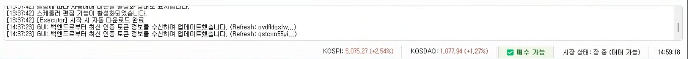
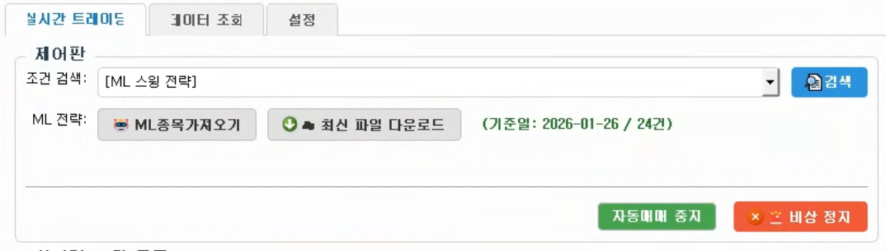
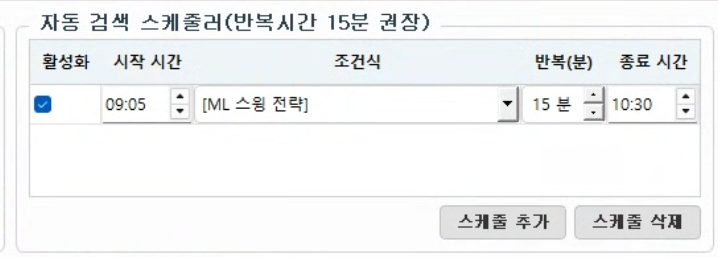
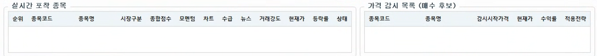
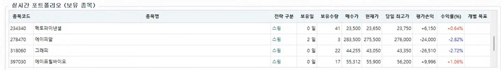
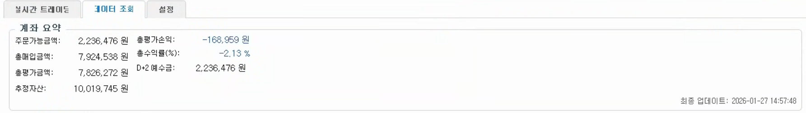
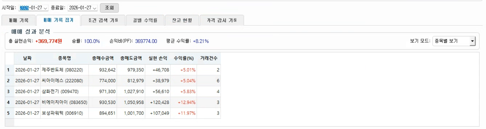
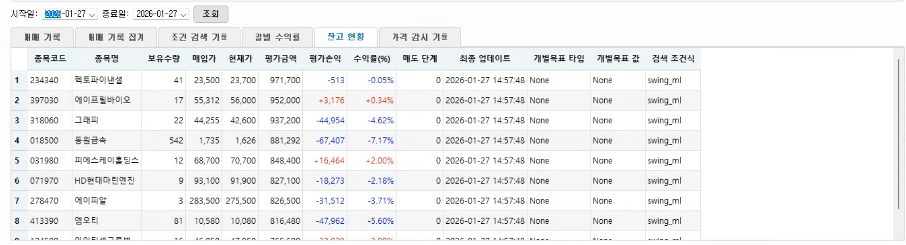
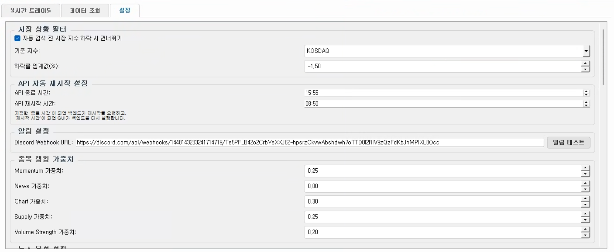
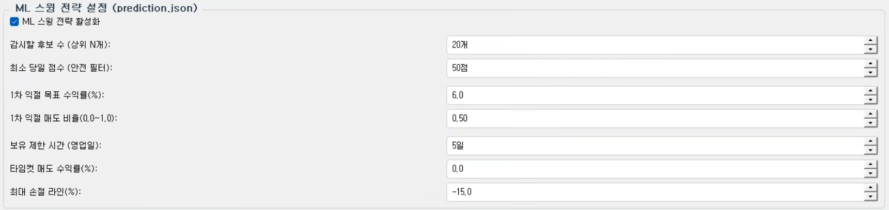

# ATS (Auto Trading System) GUI 사용 설명서

본 문서는 ATS v1.0.2의 GUI 사용 방법에 대한 상세 가이드를 제공합니다.

*
ATS 프로그램 실행 시 전체 화면 모습
*

---

## 1. 메인 화면 구성 개요

ATS GUI는 크게 상단 메뉴/상태바, 중앙 탭 영역, 하단 로그 창으로 구성되어 있습니다.

### 1.1 상태바 (Status Bar) 및 로그 창

*   **시장 상태**: 현재 장중, 장 마감, 휴장일 등의 정보를 실시간으로 표시합니다.
*   **지수 정보**: KOSPI 및 KOSDAQ 지수와 전일 대비 등락률을 표시합니다.
*   **현재 시간**: 시스템의 현재 시간을 초 단위로 표시합니다.
*   **로그 창**: 프로그램의 모든 동작 상태, API 요청/응답, 매매 실행 내역 등을 실시간으로 출력합니다. 자정에는 로그가 자동으로 초기화됩니다.

---

## 2. 실시간 트레이딩 탭

실시간 매매 모니터링 및 수동 제어를 위한 메인 탭입니다.

### 2.1 제어판 (Control Panel)

*   **조건 검색**: 키움증권 캐치(KATCH)에 등록된 조건식을 선택하고 [검색] 버튼을 눌러 종목을 포착합니다.
*   **ML 전략**: 
    *   `🤖 ML종목가져오기`: 머신러닝 예측 데이터(`prediction.json`)를 기반으로 스윙 매수 대상을 불러옵니다.
    *   `☁️ 최신 파일 다운로드`: 서버(Supabase)에서 최신 머신러닝 예측 파일을 다운로드합니다.
*   **자동매매 시작/중지**: 전체 자동매매 기능을 활성화하거나 비활성화합니다.
*   **🚨 비상 정지**: 긴급 상황 시 모든 동작을 중단하고 백엔드 프로세스를 제어합니다.

### 2.2 자동 검색 스케줄러

*   특정 시간에 특정 조건식을 자동으로 실행하도록 예약할 수 있습니다.
*   [스케줄 추가/삭제] 버튼을 통해 관리하며, 반복 실행(분 단위) 설정이 가능합니다.

### 2.3 실시간 포착 및 감시 목록

*   **실시간 포착 종목**: 선택한 조건식에 의해 실시간으로 포착된 종목들의 상세 점수와 현재가를 보여줍니다.
*   **가격 감시 목록**: 포착된 종목 중 매수 조건에 근접하여 실시간으로 가격 변화를 추적 중인 종목들입니다.

### 2.4 실시간 포트폴리오 (보유 종목)

*   현재 계좌에 보유 중인 종목의 수익률, 보유일, 전략 구분 등을 표시합니다.
*   **개별 목표 설정**: 종목을 우클릭하여 해당 종목에만 적용될 별도의 익절가, 손절가, 목표 수익률을 설정할 수 있습니다.

---

## 3. 데이터 조회 탭

과거 매매 기록 및 계좌 상태를 상세히 분석할 수 있는 탭입니다.

### 3.1 계좌 요약

*   주문가능금액, 총매입금액, 총평가금액, 추정자산, 총평가손익, 수익률 등 계좌의 핵심 정보를 한눈에 보여줍니다.

### 3.2 상세 조회 및 집계

*   **매매 기록 집계**: 종목별/일별 보기 모드를 통해 총 실현손익, 승률, PF 등의 통계 지표를 분석합니다.
*   **기타 상세 조회**: 매매 기록, 조건 검색 기록, 일별 수익률, 잔고 현황 등을 탭별로 확인할 수 있습니다.

---

## 4. 설정 탭

시스템의 모든 매매 로직과 환경 설정을 관리합니다.

### 4.1 주요 설정 항목

*   **시장 상황 필터**: 지수 급락 시 매수를 중단하는 안전 장치를 설정합니다.
*   **알림 설정**: Discord 웹훅 URL을 입력하여 실시간 알림을 받습니다.
*   **자동 매매 및 전략 설정**: 최대 보유 종목 수, 임계값, 트레일링 스탑 등을 설정합니다.

### 4.2 ML 스윙 전략 설정

*   머신러닝 기반 스윙 전략의 매수 개수, 목표 수익률, 손절 라인, 타임컷 등을 상세히 설정할 수 있습니다.

---

## 5. 사용 팁 및 주의사항

1.  **자동매매 시작 전**: 반드시 [설정] 탭에서 [설정 적용]을 눌러주세요.
2.  **ML 전략 활용**: 매일 아침 `☁️ 최신 파일 다운로드`를 권장합니다.
3.  **비상 정지**: 예상치 못한 상황 발생 시 즉시 `🚨 비상 정지` 버튼을 활용하세요.
